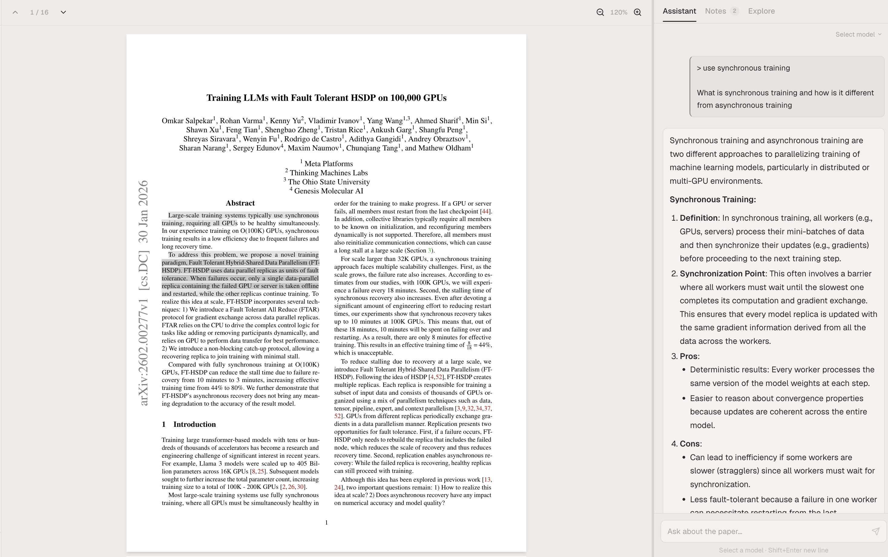
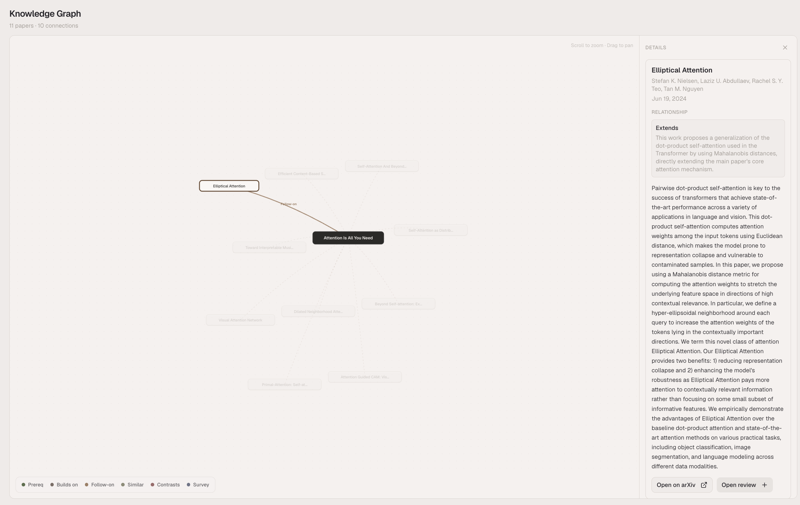

# Artifact

Reading papers is how you stay at the frontier. It's how you find the ideas worth building on, spot the gaps no one else sees, and push the boundaries of what's possible. But pasting a PDF into a chatbot doesn't do this workflow justice — you lose context between sessions, you can't annotate, and there's no way to see how papers connect.

Artifact is an open-source arXiv reader built for researchers who take this seriously. Read papers with a full-text AI assistant, annotate and discuss passages, and build a persistent knowledge graph that grows with every paper you explore.

Your keys, your browser, your data.



## Quick start

Requires Node.js 20+.

```bash
npm install
npm run dev
```

Open [localhost:3000](http://localhost:3000), add an API key in Settings, paste an arXiv ID or URL, and start reading.

## How it works

1. **Open a paper** — Paste any arXiv link. The PDF loads alongside a resizable panel with an AI assistant, annotation tools, and an analysis view.

2. **Read and ask** — Highlight a confusing passage and ask about it. The assistant has the full paper text as context, so answers are grounded in what you're actually reading. The assistant can also search for papers, look things up on the web, and save results to your knowledge graph using built-in tools.

3. **Analyze** — Click Analyze once per paper. The assistant identifies prerequisites, searches Semantic Scholar and arXiv for related work, classifies each result by relationship type (prerequisite, builds-upon, similar approach, contrasts-with, follow-on, survey), and maps everything into a graph.

4. **Build your knowledge graph** — Every analyzed paper feeds into a single knowledge graph. Come back after ten papers and you have a map of your research area — what you've read, how it connects, and what to read next.



## Features

**Paper reviews** — Each paper gets its own session with three tabs:

- **Assistant** — Streaming AI chat with full-text context. Select text in the PDF to ask targeted questions. The assistant uses an agentic loop with tools — it can search arXiv, search the web, rank results, and save papers to your knowledge graph. Markdown and LaTeX math rendering (KaTeX).
- **Notes** — Highlight passages and annotate them. Annotations anchor to specific text positions and support threaded discussion.
- **Explore** — Prerequisite checklist with study guide generation, plus a per-paper related works graph.

**Deep dives** — Start an advanced learning session from any prerequisite topic. The assistant generates structured explanations linked to the paper you're reading.

**Knowledge graph** — A unified, interactive graph across all your analyzed papers. Nodes are labeled with paper titles. Papers you've reviewed are visually distinct from discovered papers. Click any node to see its relationships, abstract, authors, and actions (open on arXiv, start a review). Pan, zoom, and relationship-colored edges with six types: prerequisite, builds-upon, follow-on, similar approach, contrasts-with, and survey.

**Analysis pipeline** — A multi-step pipeline that runs behind the scenes:

1. Identifies prerequisite concepts for the paper
2. Extracts search keywords from the paper's methods and contributions
3. Queries Semantic Scholar (with arXiv fallback) for candidate related papers
4. Classifies each candidate by relationship type with confidence scores
5. Merges results into your persistent knowledge graph

Progress appears live in the Assistant tab as each phase runs.

**Privacy** — No accounts and no telemetry. API calls go directly from your browser to the model provider. Data is stored locally in a SQLite database on the server (`/data/artifact.db`), so it persists across sessions without requiring any external services. Safe for pre-publication work.

**Multi-model** — Bring your own keys for Anthropic, OpenAI, xAI, or any OpenAI-compatible provider and switch between models from a single selector. Built-in support for Anthropic, OpenAI, and xAI. For anything else — Fireworks, OpenRouter, Together, Sail, or your own inference server — add it as an OpenAI-compatible provider with a base URL and API key.

## Contributing

Contributions are welcome — this is an open-source project and we'd love your help making it better. Please open an issue before starting work on anything substantial so we can discuss the approach.

The best way to improve the assistant's capabilities is by contributing to the **tool registry** (`src/tools/`). The assistant uses a [ReAct-style agentic loop](src/app/api/chat/) where it can call tools, observe results, and decide what to do next. Adding a new tool — or improving an existing one — directly makes the agent smarter for every user. See the existing tools (`arxiv-search`, `web-search`, `rank-results`, `save-to-graph`) for the pattern.

```bash
npm run lint     # ESLint
npm run test     # Vitest
npm run build    # Type-check + production build
```

## Tech stack

- **Framework** — Next.js 16 (App Router, Turbopack), React 19, TypeScript
- **PDF** — react-pdf / pdfjs-dist with full text extraction and selection
- **Markdown** — react-markdown, remark-gfm, remark-math, rehype-katex
- **Graph** — d3-force for layout, custom SVG rendering
- **Styling** — Tailwind CSS 4, shadcn/ui components
- **Storage** — SQLite (better-sqlite3) with WAL mode
- **AI** — Anthropic, OpenAI, xAI, and OpenAI-compatible APIs (streaming chat + structured generation)
- **Paper search** — Semantic Scholar API (primary), arXiv API (fallback)

<details>
<summary>Project structure</summary>

```
src/
├── app/
│   ├── api/
│   │   ├── arxiv-metadata/    # Fetch paper metadata from arXiv
│   │   ├── arxiv-search/      # Search arXiv for related papers
│   │   ├── chat/              # Streaming agentic chat (multi-provider, ReAct loop)
│   │   ├── data/              # CRUD persistence (reviews, annotations, settings, graph)
│   │   ├── generate/          # Structured generation for analysis pipeline
│   │   ├── models/            # Available model catalog
│   │   └── pdf/               # PDF proxy (CORS)
│   ├── discovery/             # Knowledge graph page
│   ├── review/[id]/           # Paper reader (PDF + right panel)
│   └── settings/              # API key management
├── components/
│   ├── related-works-graph    # Interactive graph (d3-force, SVG, pill nodes)
│   ├── chat-panel             # Chat with streaming + analysis progress
│   ├── prerequisites-panel    # Prerequisite checklist + study guides
│   ├── right-panel            # Tabbed panel (Assistant / Notes / Explore)
│   ├── pdf-viewer             # PDF renderer with text selection + annotations
│   ├── annotation-list        # Annotation management
│   └── sidebar                # Navigation + review history
├── hooks/
│   ├── use-auto-analysis      # Analysis trigger + status tracking
│   └── use-explore-data       # Reactive access to graph/prerequisite data
├── tools/
│   ├── arxiv-search           # Paper search tool (Semantic Scholar + arXiv)
│   ├── web-search             # General web search tool
│   ├── rank-results           # Result ranking tool
│   └── save-to-graph          # Knowledge graph persistence tool
└── lib/
    ├── explore-analysis       # Multi-phase analysis pipeline
    ├── explore                # Graph types, storage, merge logic
    ├── reviews                # Review sessions + chat message persistence
    ├── annotations            # Annotation CRUD
    ├── deep-dives             # Advanced learning sessions
    ├── models                 # Model + provider definitions
    └── server/store           # SQLite database operations
```

</details>

## License

MIT
